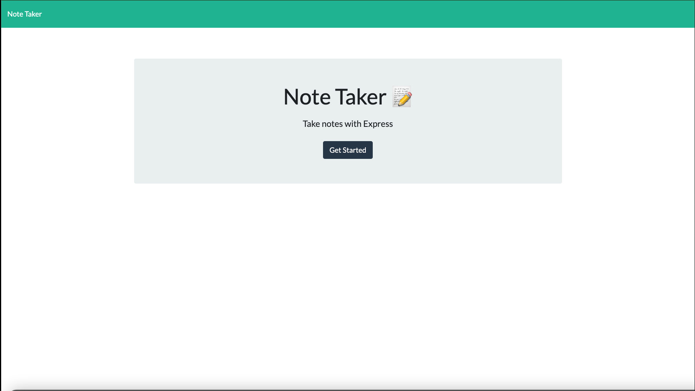
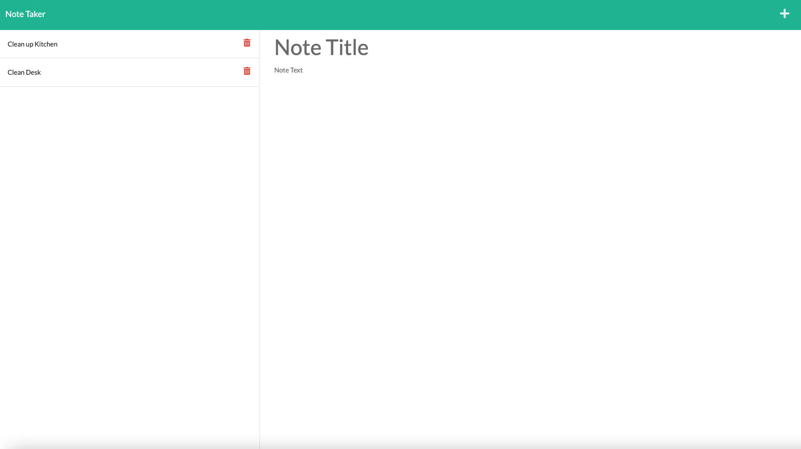

# note-taker
 

## Description

This simple note taker application allows the user to keep track of their busy schedules. From the homepage, simply click  the "Get Started" button to be taken to the note page. From here you can start taking your notes. Simply title your note and write a short description. After this, click the save icon to save the note. You can recall this note later by clicking on the note in the list on the left-hand side of the page. By clicking the "plus" icon in the right hand corner, you can make a new note. Once you have completed a task, click the delete icon to remove it.

## Table of Contents

  - [Installation](#installation)
  - [Usage](#usage)
  - [License](#license)
  - [Contributing](#contributing)
  - [Questions](#questions)
  
## Installation 

This app is deployed on Heroku at:
  
https://secret-everglades-28595.herokuapp.com/

## Usage
  

## License

This application uses the MIT license.
  
MIT: https://choosealicense.com/licenses/mit/

## Contributing
  
Email me for more info!

## Questions

If you have any questions about the repo, open an issue or 
contact me directly at ryanmbelcher86@gmail.com. You can find more of my work at 
https://github.com/ryanmbelcher.
  
